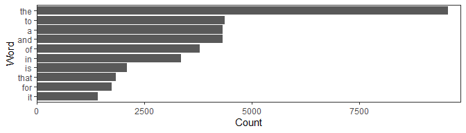

## Introduction

The basic goal for our [capstone project](https://www.coursera.org/learn/data-science-project) is to build a predictive model of the English text. When someone is typing several words one by one (for example, "I went to "), the keyboard should present options for what the next word might be.  

This task belongs to the field known as natural language processing and text mining:

- **Natural Language Processing** is interaction between computers and human (natural) languages. Specifically, the process of a computer extracting meaningful information from natural language input and producing natural language output. ([source](https://www.anexinet.com/blog/natural-language-processing-nlp-dummies/))
- **Text mining** provides a collection of techniques that allows us to derive actionable insights from unstructured data. ([source](https://learn.datacamp.com/courses/intro-to-text-mining-bag-of-words))

The goal of this intermediate report is to describe in plain language (using plots and tables) our exploratory analysis of the provided data.

This report will be focusing on:

- obtaining the data
- overview of the basic summaries of the loaded data
- sampling
- data preprocessing and cleaning 
- visualization of findings in processed data  

We will use [the bag of words method](https://en.wikipedia.org/wiki/Bag-of-words_model): the text in the provided data will be analyzed as the multiset of its words, disregarding grammar and word order but keeping multiplicity. The frequency of occurrence of each word or some combinations of words will be used as a feature for training a classifier.

## Important note

Please note that according to the terms of the assignment, the report should be written in a brief, concise style, in a way that a non-data scientist manager could evaluate the information provided. Therefore, **we *deliberately* do not display fragments of executable code** in this report, but only the results of code execution: in the form of tables and graphs.

[Here you can see the full source file of this report along with the code in our repository on GitHub.](https://github.com/nravinskaya/MilestoneReport/blob/gh-pages/index.Rmd)

## Data download

This is [the training data](https://d396qusza40orc.cloudfront.net/dsscapstone/dataset/Coursera-SwiftKey.zip) to get us started that will be the basis for most of the capstone. We will use the English database.


```
##   Data.Source Total.Size Total.Lines Total.Words Longest.Line
## 1       Blogs   255.4 Mb      899288    37570839        40833
## 2     Twitter     319 Mb     2360148    30451170          140
## 3        News   257.3 Mb     1010242    34494539        11384
```

From the table, we can see that our data consists of three datasets. 

The sizes of the news and blog datasets are about the same, but the data file from Twitter is slightly larger. 

The total number of words in each file is approximately the same. 

The total number of lines in Twitter file is 2.3 times more than in news file, and 2.6 times more than in blogs file. Obviously, this is due to the limitation of the maximum line length in Twitter (140 characters), while in the news dataset the size of the post reaches more than 11 thousand characters, and in blogs dataset as much as 40 thousand.

## Sampling

To build models we don't need to use all of the data. Often relatively few randomly selected rows or chunks need to be included to get an accurate approximation to results that would be obtained using all the data. A representative sample can be used to infer facts about a population. We can use the `rbinom` function to "flip an unbiased coin" to determine whether our sample a line of text or not. 

It will be enough for our research to select 0.5% of random records in each dataset.  


```
##      Data.Source Total.Size Total.Lines Total.Words Longest.Line
## 1          Blogs   255.4 Mb      899288    37570839        40833
## 2        Twitter     319 Mb     2360148    30451170          140
## 3           News   257.3 Mb     1010242    34494539        11384
## 4   Blogs Sample     0.5 Mb        4496      187452         2784
## 5 Twitter Sample     0.5 Mb       11800      150075          140
## 6    News Sample     0.5 Mb        5051      170399          920
```

The table shows that the number of lines in our sample datasets is about five hundred times less than the original total number of lines. Moreover, the number of words in each example is also about half a percent of the original total number of words.

## Data cleaning

Before we start try to understand the distribution of words and the relationship between words, we will first preprocess and clean our data.

#### 1. Contraction, em dashes, incorrect quotations etc

A quick look at the contents of the files revealed a mess in the use of contraction. For example, "don't" can be written as "don´t". We use `gsub`  base function for pattern replacement to unify this all for the subsequent application of standard text cleaning procedures.

Ditto for quotes and em dashes, hashtags, "at sign" and abbreviations like "1st", "2nd", "3rd", "4th" etc. All this does not give us any useful information, so we must get rid of them. 


#### 2. Remove brackets, replace abbreviations, contractions, symbols 

Using functions from `qdap` package, we remove all types of brackets. We then replace  abbreviations and contractions with long forms (e.g., "don't" becomes "do not"), and symbols with word equivalents (e.g., $ becomes "dollar").


#### 3. Translate characters

Base function `tolower` convert upper-case characters to lower-case. This is a very common operation because the data are rarely set up exactly the way we need it for doing the analysis.

#### 4. Convert characters between encodings

Our original downloaded files have been language filtered but may still contain some foreign text. We use `iconv` base function to replace all non-English characters with spaces.


## Top 10 Frequent Terms

At this point, we can quickly take a look at the words that appear most frequently in each of our datasets using the `freq_terms` function from `qdap` package.

##### Sample Blogs

<!-- -->

##### Sample Twitter

<!-- -->

##### Sample News

<!-- -->

Next, let's combine all three cleaned example datasets into one and see which words appear most frequently in this combined dataset.

##### Combined dataset

<!-- -->

These all plots show that the most frequent words in all datasets (including the combined dataset) were articles, pronouns, prepositions and other *stop words*. There are words that are frequent but provide little information.  

## Data cleaning: the last step
#### 5. Remove punctuation marks, numbers, stop words and extra whitespaces

Let's take the final step of cleaning our sample datasets using functions from `tm` package. We remove punctuation marks, numbers, stop words and extra whitespaces.


## Commonality cloud

We will now figure out which words in our three datasets are common to all three datasets. We use `commonality.cloud` function from `wordcloud` package to quickly visualize the keywords as a word cloud. 

<!-- -->

The above word cloud clearly shows that “will”, “one” and also “can”, “just”, "new", "get", "time" are the most frequent words at the intersection of these datasets. 

## Comparison cloud

Next, we are interested in which words are often found in one of each data sets, but at the same time in the other two datasets their frequency is significantly lower. We use `comparison.cloud` function from `wordcloud` package to plot a cloud comparing the frequencies of words across datasets.

<!-- -->

## Understanding the frequency of words and word pairs

Now we want to build figures to understand variation in the **frequencies** of words and word pairs in our sample datasets **without stop words**. 

We need these numbers because if we want to pass information about our text to a statistical algorithm, it must first be converted into a form suitable for calculations. One approach to this is to use a *term document matrix* (TDM) - "is a mathematical matrix that describes the frequency of terms that occur in a collection of documents" ([source](https://en.wikipedia.org/wiki/Document-term_matrix)). In TDM, rows correspond to terms (words or word pairs) in the collection and columns correspond to documents (lines from our samples).

Using functions from `tm` package, we build three matrices (one for each of our datasets) and in each of them we sort the ten words that have accumulated the largest number for all records in our dataset. 

Then we do the same, but for the *word pairs* obtained by using the tokenization function from`RWeka` package. "Tokenization is the process of breaking a text string up into words, phrases, symbols, or other meaningful elements called tokens." ([source](https://www.rdocumentation.org/packages/NLP/versions/0.2-0/topics/Tokenizer))

<!-- -->

For pairs of words, the count is about ten times less than for words. But note that the word "can", which was the second most frequently used as a single word, appears two times in the list of frequent word pairs as "can get" and "can see". 

We will take this observation into account when building our model. By seeing how often one word is followed by another particular word, we can then build a model of the relationships between them.

## 3-grams and 4-grams

"An n-gram is a contiguous sequence of n items from a given sample of text" ([source](https://en.wikipedia.org/wiki/N-gram)) In our case, 3-grams and 4-grams are consecutive sequences of words that we got as a result of the tokenization function.

When constructing the term document matrices for n-grams, the greater the value of n, the greater the number of terms and, accordingly, the greater the number or rows in this TDM. And the more memory is required to process such matrices.

To roughly look at the possible options in our samples, let's go back and generate samples of a smaller size, namely, 0.1% of the original files. This time we will first combine our three sample datasets into one and then preprocess and clean it. At the final step of cleaning we will not delete the stop words. 

<!-- -->

<!-- -->

For 3-gram, the frequency is about four times higher than for 4-gram.

## Conclusion

Based on all of the above, we consider it important to take into account the following points when creating the predictive model and Shiny app:

- find the optimal sample size so that it does not overload memory, and on the other hand, provides good word coverage.
- build the term document matrices for single words (1-grams), word pairs (2-grams), 3- and 4-grams.
- first analyze the last 3 words typed by the user, compare them with our 4-gram matrix, and if nothing is found, use 2 last words and 3-gram matrix, then just the last user typed word and 2-gram matrix. 

Thank you!
